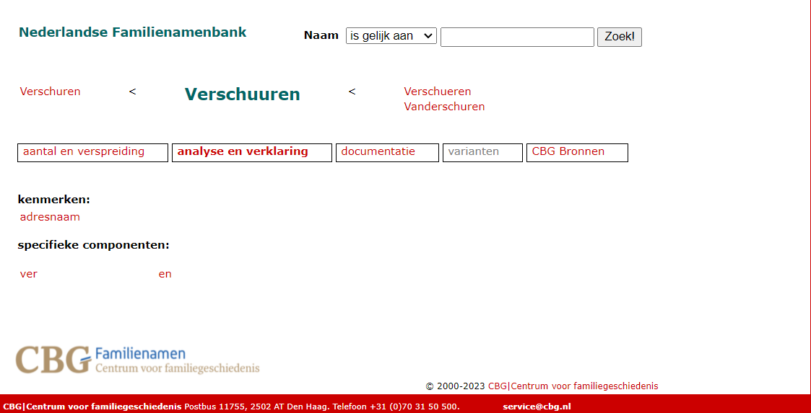
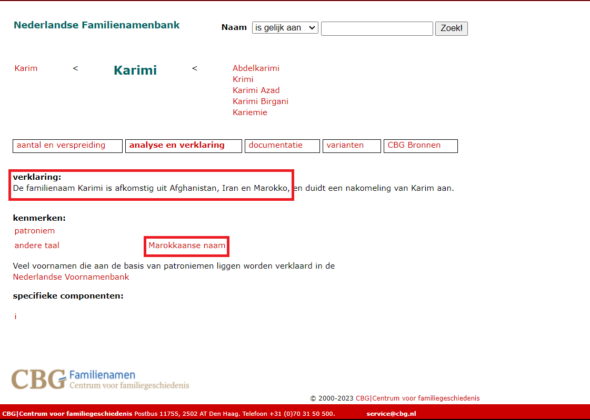

<!---please be aware that caching large objects is problematic, hence cache.lazy=FALSE and you may need to turn cache=FALSE for chuncks in which you load large datasets ---> 

```{r, globalsettings, echo=FALSE, warning=FALSE}
library(knitr)
opts_chunk$set(tidy.opts=list(width.cutoff=100),tidy=TRUE, warning = FALSE, message = FALSE,comment = "#>", cache=TRUE, class.source=c("test"), class.output=c("test2"), cache.lazy = FALSE, eval=FALSE)
options(width = 100)
rgl::setupKnitr()

colorize <- function(x, color) {sprintf("<span style='color: %s;'>%s</span>", color, x) }

```

```{r klippy, echo=FALSE, include=TRUE}
klippy::klippy(position = c('top', 'right'))
#klippy::klippy(color = 'darkred')
#klippy::klippy(tooltip_message = 'Click to copy', tooltip_success = 'Done')
```


----


We determine ethnic backgrounds based on last names. For this, we use information from three sources:

1. Data on the origin of last names, web scraped from the [Nederlandse Familienamenbank](https://www.cbgfamilienamen.nl/nfb/)

2. A list of common Moroccan names

3. Birth countries listed in dissertation PDFs


  
----

# Custom functions

- `pacage.check`: Check if packages are installed (and install if not) in R ([source](https://vbaliga.github.io/verify-that-r-packages-are-installed-and-loaded/)).  


```{r, results='hide'}
fpackage.check <- function(packages) {
  lapply(packages, FUN = function(x) {
    if (!require(x, character.only = TRUE)) {
      install.packages(x, dependencies = TRUE)
      library(x, character.only = TRUE)
    }
  })
}

fsave <- function(x, file, location="./data/processed/") {
  datename <- substr(gsub("[:-]", "", Sys.time()), 1,8)  
  totalname <- paste(location, datename, file, sep="")
  save(x, file = totalname)  
}

```

---  

# Packages


- `stringr`: for string manipulations

```{r, results='hide'}


packages = c("tidyverse", "stringr", "dplyr", "rvest", "stringi", "forcats")

fpackage.check(packages)

```

--- 


# Input

We use two processed datasets

* [phdnames.rda](): example dataset of 8 (fictional) PhDs with first and last names
    - For construction of this dataset see [(names.html)]  
    - name of dataset: `phdnames` 

* [ethnicity.rda](): web scraped ethnicity data for the 8 last names in the example data
    - name of dataset: `gender` 
    
    
    

* [phd_metadf.rda](./data/processed/phd_metadf.rda): dataset of PhDs with cleaned names + addendum  
    - For construction of this dataset see [(names.html)]  
    - name of dataset: `phd_metadf` 


* [familienamenbank.rda](./data/familienamenbank.rda): contains last names and origin information scraped from Meertens Familienamenbank  
    - For construction of this dataset see [1_scraper_freq_origin.R](./name_data/global/lname/1_scraper_freq_origin.R) & [2_cleaning_origin.RMD](./name_data/global/lname/2_cleaning_origin.RMD)  
    - name of dataset: `origin_ln` 


* [diss_info](./data/processed/diss_info.rda): we use the dissertation PDF files to construct origin based on birth countries
    - For construction of this dataset see [(names_dissertation.Rmd)]  
    - name of dataset: `diss_info` 


* [genderizer.rda](./data/processed/genderizer.rda): first names and genders based on Genderizer
    - For construction of this dataset see [(genderizer.html)]  
    - name of dataset: `genderizer` 


<!---if loading large datafiles, please add cache=FALSE to chunk---> 

```{r datasets, cache=FALSE}

rm(list = ls())

load(file = "./data/processed/phdnames.rda")

load(file = "./data/processed/lastname_origin.rda")


```

---  

# Method 1: Familienamenbank last name origin

The primary determinant for ethnicity is [de Nederlandse Familienamenbank](https://www.cbgfamilienamen.nl/nfb/)(hereafter "Familienamenbank"). This website, like the Meertens Voornamenbank which was used to determine researchers' gender, uses register data from Dutch inhabitants. Specifically, the website harbors information on the frequency, geographical spread, and origin of 320,000 last names which occur in the Dutch register. 

The origin information, specifically, is used to determine researchers' ethnicities. This information is found under the 'analyse en verklaring' tab of the name page. 
This information is structured so that, if names are Dutch, more detailed origins of the name are mentioned (e.g. whether the last name originates from a certain profession, geographical region in the Netherlands or whether it is derived from fathers' first names). If names are not Dutch, however, only the country or broader region from which the name originates is mentioned. See below for examples of these pages for a Dutch and a non-Dutch last name.  





We scraped the "analyse en verklaring" section for each of the last names in our sample. The latter image shows that the subsection "verklaring" and "kenmerken" provide information on the countries associated with non-Dutch names, while "specifieke componenten" provides more information on certain parts of the name. The resulting dataframe for our example dataset is shown below.

```{r}

print(lastname_origin, row.names=FALSE)

```


## Separating names with Dutch & unknown origin

As mentioned earlier, it is not mentioned explicitly that Dutch names are Dutch. Therefore, we need to identify Dutch names specifically, and set them apart from non-Dutch names for which there is no origin information present. 

In short, we detect the two categories of names as follows:
- Dutch names: no label indicating that the name is Dutch, but some other information available on name origin
- Unknown names: web page cannot be found, so origin information is completely empty. 

```{r origin-unknown}

# Identify last names that could not be found
lastname_origin <- lastname_origin %>%
  mutate(verklaring = ifelse(verklaring=="", 0, verklaring), 
         kenmerken = ifelse(kenmerken=="character(0)", 0, kenmerken),
         sc = ifelse(sc=="character(0)", 0, sc),
         no_info = nchar(verklaring) + nchar(kenmerken) + nchar(sc))

lastname_origin <- lastname_origin %>%
  mutate(no_info = ifelse(no_info==3, 1, 0), 
         verklaring = ifelse(verklaring==0, NA, verklaring),
         kenmerken = ifelse(kenmerken==0, NA, kenmerken))
# If there is no text in verklaring or kenmerken, the name could not be found in the databases. 

```


## Extracting specific origin information
There are three main ways to get information about the origin of last names:

1) Under "kenmerken", last names are assigned clickable tags. These tags include unspecified foreign name tags ("andere taal"="non-Dutch language"), as well as specific foreign origins of the name ("Franse naam"="French name", "Indische naam"="Indonesian name").
-> origin1 + origin4

2) Several names have more extensively written out information about the name, under "verklaring". A number of names contain detailed (either country-level or regional) origins, usually in the form of "De naam [xyz] is afkomstig uit [country]" (="The name [xyz] originates from [country]"). 
-> origin2 

3) Some names have origin information under "verklaring" in the form of the linguistic origins of the name. This can be country specific (e.g. Chinese name), but it can also apply to multiple countries when the language is spoken in more than 1 countries (e.g. Spanish name). 
-> origin3 

```{r countries-extract}

# Step 1: extracting origin tags from kenmerken
lastname_origin <- lastname_origin %>%
  mutate(origin1 = str_extract(kenmerken, "[:upper:]([:lower:]{2,}) naam"))

# Note: sometimes multiple origins are mentioned. Currently, I only extract the first one. Otherwise, we should use str_extract_all. 


# Step 2: extracting origin info from verklaring 
lastname_origin <- lastname_origin %>%
  mutate(origin2 = ifelse(as.numeric(str_detect(verklaring, "afkomstig uit")) == 1, 
         str_remove(verklaring, ".*afkomstig uit"), NA))


# Step 3: extracting additional origin info from verklaring
lastname_origin <- lastname_origin %>%
  mutate(origin3 = str_extract(verklaring, "[:upper:]([:lower:]{2,}) (achter)?(familie)?(beroeps)?naam"))


# Finally, we clean up the origin information extracted above

# Origin1: already neat
lastname_origin$origin1 <- str_remove(lastname_origin$origin1, "Joodse naam") # can be Dutch & non-Dutch

# Origin2: messy
lastname_origin$origin2 <- str_remove(lastname_origin$origin2, "\\..*") # remove extra info in the following sentence 
lastname_origin$origin2 <- str_remove(lastname_origin$origin2, "\\;.*") # remove extra info in the following sentence 
lastname_origin$origin2 <- str_remove(lastname_origin$origin2, "\\(.*") # remove extra info in the following sentence 


lastname_origin$dpg <- as.numeric(str_detect(lastname_origin$origin2, "(dorp)|(plaats)|(gemeente)|(graafschap)|(stad)|(deel)|(Friesland)")) # origin info too regional 
lastname_origin <- lastname_origin %>% mutate(origin2 = ifelse((dpg==1), NA, origin2)) # removing regional origin info
lastname_origin <- subset(lastname_origin, select = -dpg) # removing intermediate variable

# Sometimes, there were multiple countries mentioned. Take only the first:
lastname_origin$origin2 <- str_remove(lastname_origin$origin2, "\\,.*") # Only first
lastname_origin$origin2 <- str_remove(lastname_origin$origin2, "\\s(en).*") # Only first 
lastname_origin$origin2 <- str_remove(lastname_origin$origin2, "\\s(of).*") # Only first 


# Origin3: pretty neat
lastname_origin$origin3 <- str_remove(lastname_origin$origin3, "D(i)?e(ze)? (familie)?(achter)?(beroeps)?naam") # slipped through the regex
lastname_origin$origin3 <- str_remove(lastname_origin$origin3, "Een (familie)?(achter)?(beroeps)?naam") # slipped through the regex
lastname_origin$origin3 <- str_remove(lastname_origin$origin3, "Zijn (familie)?(achter)?(beroeps)?naam") # slipped through the regex
lastname_origin$origin3 <- str_remove(lastname_origin$origin3, "Als (familie)?(achter)?(beroeps)?naam") # slipped through the regex
lastname_origin$origin3 <- str_remove(lastname_origin$origin3, "Joodse (familie)?(achter)?naam")
lastname_origin$origin3 <- str_remove(lastname_origin$origin3, "Bijbelse (familie)?(achter)?naam")


# Setting empty origin variables to NA (Dutch or unfound foreign)
lastname_origin <- lastname_origin %>%
  mutate(origin1 = as.character(ifelse(origin1==""|origin1=="character(0)", NA, origin1)),
         origin2 = as.character(ifelse(origin2==""|origin2=="character(0)", NA, origin2)),
         origin3 = as.character(ifelse(origin3==""|origin3=="character(0)", NA, origin3)))


# Finally, the tag "andere taal" was used to distinguish foreign names of unknown origin from known Dutch names. 
lastname_origin <- lastname_origin %>%
  mutate(origin4 = ifelse((as.numeric(str_detect(kenmerken, "andere taal"))==1), "non-Dutch", NA))


```


The result is as follows:

```{r}

lastname_origin[,c(1,6,7,8,9)]

```


## Combining origin info from different sources

Now, we potentially have origin information from three different sources. The final origin decision is based on how dependable and how informative the label is. The heuristic is as follows:

1) Priority is given to origin information from specific country tags (i.e. origin1), because this information is the most neat. If no country tag is provided under origin1, we look at the geographical origins indicated in the running text (origin 2). If this is also not present, we take the linguistic origins of the name (origin 3) 

2) If there is no specific country information, but there is a tag for a foreign name (origin4), then the name is labelled as "unknown non-Dutch". 

3) If there is no specific country information AND no tag for foreign name in origin4, but there is other information about the name, we assume the person bearing this name is Dutch. 

In sum: origin1 > origin2 > origin3 > origin4. 

```{r combining-origin123}

# Origin 1: specific country tags 
lastname_origin <- lastname_origin %>%
  mutate(origin = origin1) 

# Origin 2: no specific country tag, take the geographical origin of the name
lastname_origin <- lastname_origin %>%
  mutate(origin = ifelse((is.na(origin1)&!is.na(origin4)), origin2, origin))

# Origin 3: neither of the above, take the linguistic origin of the name
lastname_origin <- lastname_origin %>%
   mutate(origin = ifelse((is.na(origin1)&is.na(origin2)&!is.na(origin4)), origin3, origin))

# Origin 4: set to unknown non-Dutch if the name is labelled as such with no specific origin info
lastname_origin <- lastname_origin %>%
    mutate(origin = ifelse((is.na(origin1)&is.na(origin2)&is.na(origin3)), origin4, origin))

# Final step: if there is no origin information present, but other background information could be found, the name is likely Dutch.
lastname_origin <- lastname_origin %>%
  mutate(origin = ifelse((is.na(origin)&no_info==0), "dutch", origin))

lastname_origin$origin <- trimws(lastname_origin$origin, which = "both")

```


To construct the ethnicity variable, we distinguish five different backgrounds:
1. Ethnic majority members (i.e. those with Dutch names)
2. Turkish-Dutch individuals
3. Moroccan-Dutch individuals
4. Caribbean-Dutch individuals
5. Those with a different ethnicity from those listed above


```{r origin5cat}

lastname_origin$origin1 <- lastname_origin$origin

lastname_origin <- subset(lastname_origin, select = c(lastname, origin1))


# we define different ways in which ethnic minority names are identified in the "Familienamenbank"
lastname_origin <- lastname_origin %>%
  mutate(origin1 = ifelse(as.numeric(str_detect(origin1, paste("(Turkije)|(Turkse naam)"))), "turkish", origin1))

lastname_origin <- lastname_origin %>%
  mutate(origin1 = ifelse(as.numeric(str_detect(origin1, paste("(Marokkaanse naam)|(Marokko)|(de Marokko)"))), "moroccan", origin1))

lastname_origin <- lastname_origin %>%
  mutate(origin1 = ifelse(as.numeric(str_detect(origin1, paste("(de Nederlandse Antillen)|(Surinaamse naam)|(Suriname)"))), "carribean", origin1))

lastname_origin <- lastname_origin %>%
  mutate(origin1 = ifelse((!is.na(origin1)&as.numeric(str_detect(origin1, "turkish|moroccan|carribean|dutch"))==0), "other", origin1))

lastname_origin$origin1 <- as.factor(lastname_origin$origin1)
      

# we create an explicit 'missing' category for those who are not categorized under ethnic majority, minority or 'other lastname_origin'
lastname_origin <- lastname_origin %>%
  mutate(origin1 = fct_explicit_na(origin1, na_level="missing"))


# thus, we get the following dataframe:
lastname_origin

```


We take the last name information from origin1 as the basis for our ethnicity variable. Hence, we make a new data frame, in which we copy the information from origin1 to a new 'ethnicity' object. Next, we enrich this ethnicity variable using information from first names and birth places listed in dissertation PDFs. 

``` {r}

phdethnicity <- lastname_origin

phdethnicity$ethnicity <- phdethnicity$origin1

```


# Method 2: Moroccan name list


In addition to determining ethnicity based on last names, we look at first names. Specifically, we use a list of Moroccan first names to detect whether an individual is likely of Moroccan descent. Untill very recently, first names of Moroccan individuals were regulated by Moroccan law [@haskouri]. This implies that many Moroccan individuals choose names for their children from a list of accepted girls and boys names. We load in a list of names by @`Morocco Guide` as an additional indicator that a PhD is Moroccan and add this to our example data frame. 


```{r}

# Adding first names back in
phdethnicity <- left_join(phdnames, phdethnicity, by = "lastname")


# Add the moroccan names to the ethnicity data
load(file = "data/processed/moroccannames.rda")


phdethnicity <- left_join(phdethnicity, moroccannames[,c(1,3)], by = "firstname")


# Add explicit missing category in origin2
phdethnicity <- phdethnicity %>%
  mutate(origin2 = fct_explicit_na(origin2, na_level="missing"))

# We overwrite ethnicity to minority if the first name is Moroccan
for (i in 1:nrow(phdethnicity)) {
  if (phdethnicity$origin1[i]=="missing" & phdethnicity$origin2[i]=="moroccan") {
    phdethnicity$ethnicity[i] <- "moroccan"
  } else if (phdethnicity$origin1[i]=="dutch" & phdethnicity$origin2[i]=="moroccan") {
    phdethnicity$ethnicity[i] <- "moroccan"
  } else if (phdethnicity$origin1[i]=="other" & phdethnicity$origin2[i]=="moroccan") {
    phdethnicity$ethnicity[i] <- "moroccan"
  } 
}

```


Let's see what the data looks like. In this case, we see that the two methods for determining ethnicity (at least with regards to Moroccan vs non-Moroccan) appear to be in agreement. 

```{r}

phdethnicity[,c(1,2,5,9,11,6)]

```


# Method 3: PDF birth places

Based on lists of Dutch municipalities, we can establish whether someone was born in the Netherlands. We use lists of municipalities provided by Statistics Netherlands from the years 2006/2014/2015/2016/2018/2019/2020/2021, as well as mutations in municipalities or municipality names during the period of this study [@Statistics Netherlands].

If the birth place info contains a Dutch municipality or a reference to the Netherlands, a person is born in the Netherlands. If there is a reference to Turkey, Morocco, the

```{r}

# loading in the list of Dutch municipalities
load(file = "data/municipalities/dutch_mun_all.rda")

# creating strings with indicators for birth countries (The Netherlands, Caribbean Netherlands, Turkey, Morocco)
dutch <- c(as.character(dutch_mun$municipality), "netherlands", "the netherlands", "nederland","\\snl\\s")

carribean <- c("suriname", "nederlandse antillen", "curacao", "curaçao", "bonaire", "\\sssaba\\s", "sint eustatius", "sint maarten", "aruba")

turkish <- c("turkije", "turkey")

moroccan <- c("marokko", "morocco")


# Origin3: country of birth variable
phdethnicity$origin3 <- ifelse(as.numeric(str_detect(phdethnicity$diss_birthplace, paste(dutch, collapse = "|")))==1, "dutch", NA)

phdethnicity$origin3 <- ifelse(as.numeric(str_detect(phdethnicity$diss_birthplace, paste(carribean, collapse = "|")))==1, "caribbean", phdethnicity$origin3)

phdethnicity$origin3 <- ifelse(as.numeric(str_detect(phdethnicity$diss_birthplace, paste(turkish, collapse = "|")))==1, "turkish", phdethnicity$origin3)

phdethnicity$origin3 <- ifelse(as.numeric(str_detect(phdethnicity$diss_birthplace, paste(moroccan, collapse = "|")))==1, "moroccan", phdethnicity$origin3)


phdethnicity$origin3 <- factor(phdethnicity$origin3, levels=c("dutch", "caribbean", "turkish", "moroccan"))

# Create explicit missing category
phdethnicity <- phdethnicity %>%
  mutate(origin3 = fct_explicit_na(origin3, na_level="missing"))


# We replace missing or other with "dutch" if a person is born in NL
# We replace missing, other, dutch and moroccan with "turkish" if a person is born in Turkey
# We replace missing, other, dutch and turkish with "moroccan" if a person is born in Morocco

for (i in 1:nrow(phdethnicity)) {
  if (phdethnicity$ethnicity[i]=="missing" & phdethnicity$origin3[i]=="dutch") {
    phdethnicity$ethnicity[i] <- "dutch"
  } else if (phdethnicity$ethnicity[i]=="other" & phdethnicity$origin3[i]=="dutch") {
    phdethnicity$ethnicity[i] <- "dutch"
    } else if (phdethnicity$ethnicity[i]=="missing" & phdethnicity$origin3[i]=="moroccan") {
    phdethnicity$ethnicity[i] <- "moroccan"
  } else if (phdethnicity$ethnicity[i]=="dutch" & phdethnicity$origin3[i]=="moroccan") {
    phdethnicity$ethnicity[i] <- "moroccan"
  } else if (phdethnicity$ethnicity[i]=="other" & phdethnicity$origin3[i]=="moroccan") {
    phdethnicity$ethnicity[i] <- "moroccan"
  } else if (phdethnicity$ethnicity[i]=="turkish" & phdethnicity$origin3[i]=="moroccan") {
    phdethnicity$ethnicity[i] <- "moroccan"
  } else if (phdethnicity$ethnicity[i]=="missing" & phdethnicity$origin3[i]=="turkish") {
    phdethnicity$ethnicity[i] <- "turkish"
  } else if (phdethnicity$ethnicity[i]=="dutch" & phdethnicity$origin3[i]=="turkish") {
    phdethnicity$ethnicity[i] <- "turkish"
  } else if (phdethnicity$ethnicity[i]=="other" & phdethnicity$origin3[i]=="turkish") {
    phdethnicity$ethnicity[i] <- "turkish"
  } else if (phdethnicity$ethnicity[i]=="moroccan" & phdethnicity$origin3[i]=="turkish") {
    phdethnicity$ethnicity[i] <- "turkish"
  } 
}

```


After all these operations, we are left with an ethnicity object which is based on origins of last names and first names, and on the birth place listed in the dissertation. 

For these example cases, the labels given based on these different indicators overlap perfectly, but the code above gives insight in the heuristics we use to combine potentially conflicting ethnicity labels. 

```{r}

phdethnicity[,c(2,5,6,10,9,11,12)]

```


# Ethnicity 2

Although we need the specific ethnicity labels for our measure of gender, we use a less-detailed measure of ethnic background for our analyses. In this measure we distinguish between individuals with an ethnic majority, ethnic minority  (Turkish-Dutch, Moroccan-Dutch, Caribbean-Dutch) or other ethnic background. This has to do with small group sizes for each of the specific ethnic minority backgrounds. 

We subsume "missing" ethnic background under other ethnic background, because we believe that it is unlikely that a person with a Dutch majority, Turkish-Dutch, Moroccan-Dutch or Caribbean-Dutch background would have gone unnoticed using our array of methods to determine ethnicity. 

```{r}

phdethnicity$ethnicity2 <- phdethnicity$ethnicity

phdethnicity$ethnicity2 <- fct_collapse(phdethnicity$ethnicity2,
             majority = "dutch",
             minority = c("moroccan", "turkish", "carribean"),
             other = c("other", "missing"))


phdethnicity <- subset(phdethnicity, select=c(id, firstname, np, lastname, lastname_full, diss_birthplace, uni, phd_year, ethnicity, ethnicity2))

```


--- 

# Output


```{r eval=FALSE}

# origin1
save(phdethnicity, file = "./data/processed/phdethnicity.rda")

```


---  

# References


