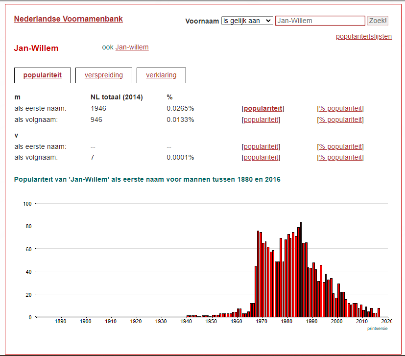

```{r, globalsettings, echo=FALSE, warning=FALSE, results="hide"}

library(knitr)
opts_chunk$set(tidy.opts=list(width.cutoff=100),tidy=TRUE, warning = FALSE, message = FALSE,comment = "#>", cache=TRUE, class.source=c("test"), class.output=c("test2"), cache.lazy = FALSE)
options(width = 100)
rgl::setupKnitr()

colorize <- function(x, color) {sprintf("<span style='color: %s;'>%s</span>", color, x) }

```

```{r klippy, echo=FALSE, include=TRUE}
klippy::klippy(position = c('top', 'right'))
#klippy::klippy(color = 'darkred')
#klippy::klippy(tooltip_message = 'Click to copy', tooltip_success = 'Done')
```


----

This lab journal demonstrates how first names of doctoral recipients are used to infer gender, using the mock dataset created in [Names](names.html)   
  
----

# Custom functions

- `package.check`: Check if packages are installed (and install if not) in R ([source](https://vbaliga.github.io/verify-that-r-packages-are-installed-and-loaded/)). 


```{r, results='hide'}

rm(list=ls())


fpackage.check <- function(packages) {
  lapply(packages, FUN = function(x) {
    if (!require(x, character.only = TRUE)) {
      install.packages(x, dependencies = TRUE)
      library(x, character.only = TRUE)
    }
  })
}


```

---  

# Packages

- `tidyverse`: For general data manipulaion

- `rrapply`: For detecting empty nested lists  

- `stringr`: For string manipulations

- `dplyr`: for data manipulation


```{r, results='hide'}
packages = c("tidyverse", "rrapply", "stringr", "dplyr")

fpackage.check(packages)


```

--- 


# Input

We use two processed datasets

* [phdethnicity](https://github.com/ammulders/amatteroftime/data/processed/phdethnicity.rda): example dataset of 8 (fictional) PhDs with first and last names, and ethnicity attached
    - For construction of this dataset see [Independent variables: names](names.html) & [Independent variables: ethnicity](ethnicity.html)
    - name of dataset: `phdnames` 

* [gender.rda](https://github.com/ammulders/amatteroftime/data/processed/gender.rda): web scraped gender data for the 8 first names in the example data, from Meertens Voornamenbank
    - name of dataset: `gender` 
    
* [genderizer_all.rda](https://github.com/ammulders/amatteroftime/data/genderizer_all.rda): web scraped gender data for the 8 first names in the example data, from Genderizer global
    - name of dataset: `genderizer_all`
    
* [genderizer_nl.rda](https://github.com/ammulders/amatteroftime/data/genderizer/genderizer_nl.rda): web scraped gender data for the 8 first names in the example data, from Genderizer Netherlands
    - name of dataset: `genderizer_nl` 

* [genderizer_ma.rda](https://github.com/ammulders/amatteroftime/data/genderizer/genderizer_ma.rda): web scraped gender data for the 8 first names in the example data, from Genderizer Morocco
    - name of dataset: `genderizer_ma` 

* [genderizer_tr.rda](https://github.com/ammulders/amatteroftime/data/genderizer/genderizer_tr.rda): web scraped gender data for the 8 first names in the example data, from Genderizer Turkey
    - name of dataset: `genderizer_tr` 


```{r files, eval=TRUE}

load(file = "data/processed/phdethnicity.rda")

load(file = "data/processed/gender.rda")


load(file = "data/genderizer/genderizer_all.rda")
load(file = "data/genderizer/genderizer_nl.rda")
load(file = "data/genderizer/genderizer_ma.rda")
load(file = "data/genderizer/genderizer_tr.rda")

```


---  


# Method 1: Scraping Meertens voornamenbank

The first step of our operations is webscraping the [Meertens voornamenbank](https://www.meertens.knaw.nl/nvb/). This website contains a database of first names of all individuals that have once been registered in the "Personal Records Database (BRP)", and the gender that is indicated on their official government documents. People who live in the Netherlands for at least 4 months are registered in the BRP. The Meertens Voornamenbank contains data on names + gender from 1880 to 2016. We scraped unique first names from our sample of PhDs. 


For the first PhD in our data, we would scrape the [Voornamenbank page for 'Jan-Willem'](https://www.meertens.knaw.nl/nvb/naam/is/jan-willem). 

```{r}

phdethnicity[1,c(1,2)]

```

This would yield the following data:

In this image, the 'm' and 'v' sections represent frequencies of the name among men and women respectively. The first number for each gender represents the frequency of the name as primary first name, while the second number counts how often the name occurs as Christian name. We only extracted the numbers for the primary first name, because Christian names can be more ambiguous in terms of gender.



When doing this for all names in our sample, we obtain the dataframe as below. 

```{r}

print(gender, row.names=FALSE)

```


Next, we apply a simple majority rule to obtain gender.

```{r}

gender %>% 
  mutate(freq_m = ifelse((freq_m=="--"), 0, freq_m), 
         freq_f = ifelse((freq_f=="--"), 0, freq_f), 
         female = ifelse((freq_f > freq_m), 1, 0),
         female = ifelse((freq_m == freq_f), NA, female)) -> gender


# renaming the variable and transforming into a factor

gender$female <- as.factor(gender$female)
levels(gender$female)
levels(gender$female) <- c("men", "women")
gender <- gender %>% dplyr::rename(gender = female)


# dropping the frequency variables
gender <- subset(gender, select = c(firstname, gender))


```

Now, we are left with a dataframe that contains first names and associated genders. 

```{r}

# we add the new variable to our dataframe
phdgender <- left_join(phdethnicity, gender, by="firstname")

phdgender[,c(2,11)]


```


# Method 2: GenderizeR

Next, we used the (genderizeR)[https://github.com/kalimu/genderizeR] package to supplement gender information based on the Meertens Voornamenbank. GenderizeR compiles information on names from different sources (e.g. social media profiles) and the data is country-coded. To get the most accurate gender information for our first names, we scraped not only the global database, but also the specific databases for the Netherlands, Turkey and Morocco. 

To match first names and genders with country-specific info, we first add ethnicity information as we gathered it in [(ethnicity.html)]

Then, we combine the different genderizer databases into a single dataframe, to most efficiently extract gender information depending on ethnicity. 

Finally, we add the gender data from specific databases to our PhD dataframe. In doing so, we give priority to the Meertens Voornamenbank. We prioritize the Meertens gender information, because this database is more open with regards to the its sources and therefore we think the quality of this gender data is likely higher. 

```{r}

# combining the different genderizeR databases into a single dataframe
colnames(genderizer_all) <- c("firstname", "count_all", "gender_all", "probability_all")
colnames(genderizer_tr) <- c("firstname", "count_tr", "gender_tr", "probability_tr")
colnames(genderizer_ma) <- c("firstname", "count_ma", "gender_ma", "probability_ma")
colnames(genderizer_nl) <- c("firstname", "count_nl", "gender_nl", "probability_nl")


genderizer <- cbind.data.frame(genderizer_all, genderizer_nl[,-1], genderizer_tr[,-1], genderizer_ma[,-1]) # removing the firstname objects to avoid duplicate columns


genderizer$gender_all <- dplyr::recode(genderizer$gender_all, "male"="men", "female"="women")
genderizer$gender_nl <- dplyr::recode(genderizer$gender_nl, "male"="men", "female"="women")
genderizer$gender_ma <- dplyr::recode(genderizer$gender_ma, "male"="men", "female"="women")
genderizer$gender_tr <- dplyr::recode(genderizer$gender_tr, "male"="men", "female"="women")

    

# adding genderizeR data to the example PhD dataframe
phdgender <- cbind.data.frame(phdgender, genderizer[,-1])

# we take country-specific genderizeR data where applicable, else the complete genderizeR database
phdgender %>%
  mutate(genderZ = gender_all,
         genderZ = ifelse(ethnicity=="dutch", gender_nl, genderZ),
         genderZ = ifelse(ethnicity=="moroccan", gender_ma, genderZ),
         genderZ = ifelse(ethnicity=="turkish", gender_tr, genderZ)) -> phdgender

phdgender$genderZ <- factor(phdgender$genderZ, levels=levels(phdgender$gender))

# Only use genderizeR when gender is not present from Meertens
phdgender$gender <- ifelse(is.na(phdgender$gender), phdgender$genderZ, phdgender$gender)

phdgender$gender <- as.factor(phdgender$gender)
levels(phdgender$gender) <- c("men", "women")

```


# Output 

```{r}

phdgender[,c(2,5,11)]

```


Saving

```{r, eval=FALSE}

phdgender <- subset(phdgender, select=c(id, firstname, lastname_full, diss_birthplace, uni, phd_year, ethnicity, ethnicity2, gender))

save(phdgender, file="data/processed/phdgender.rda")

```


---  

# References

